## __LOAD BALANCING SOLUTION WITH APACHE__ ##

__Load balancing__ is the method of distributing network traffic equally across a pool of resources that support an application. Modern applications processes millions of users simultaneously and return the correct information to each user in a fast and reliable manner. To handle such high volumes of traffic, most applications have many resource servers with duplicate data between them. A load balancer is a device that __sits between the user and the server group and acts as an invisible facilitator, ensuring that all resource servers are used equally.__

In [Project-7](https://github.com/dybran/project-7), We have three different IP addresses for the various servers. In ideal scenarios,we will have so many web servers serving the same information from the NFS server. To make this easier for the users, we will introduce a load balancer so that we access all the information from one IP address.

When we access a website in the Internet we use URL and we do not really know how many servers are out there serving our requests, this complexity is hidden from a regular user, but in case of websites that are being visited by millions of users per day (like Google, facebook, amazon etc ) it is impossible to serve all the users from a single Web Server. it is also applicable to databases too.

Each URL contains a domain name part, which is translated (resolved) to IP address of a target server that will serve requests when open a website in the Internet. Translation (resolution) of domain names is performed by DNS servers.

In order to hide all this complexity and to have a single point of access with a single public IP address/name, a Load Balancer can be used. __A Load Balancer (LB) distributes clients’ requests among underlying Web Servers and makes sure that the load is distributed in an optimal way.__

For more information on load balancing, click [here](https://aws.amazon.com/what-is/load-balancing/).

We will be updating solution architecture with a LB added on top of Web Servers. We will be using a software L7 Application LB eg. Apache, NGINX or HAProxy.

## __3-TIER WEB APPLICATION ARCHITECTURE WITH A SINGLE DATABASE, AN NFS SERVER AS A SHARED FILE STORAGE AND A LOAD BALANCER__ ##

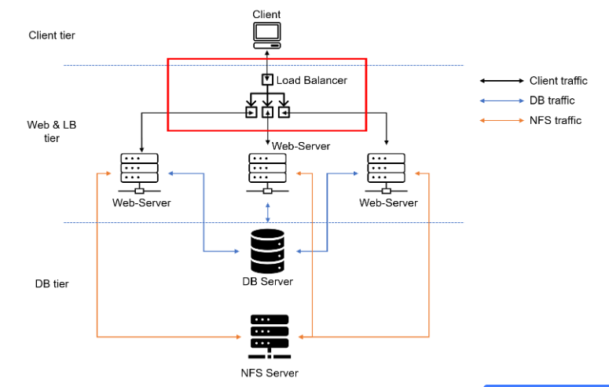

In this project we will enhance [Project-7](https://github.com/dybran/project-7) by adding a Load Balancer to disctribute traffic between Web Servers and allow users to access our website using a single URL.

From project 7, we should make sure of the following:
- Apache process is up and running on the webservers.
- __"/var/www"__ of the webservers are mounted on __"/mnt/apps"__.
- All necessary TCP/UDP ports are open on the webservers, database server and NFS server.
- client server can access both webservers by thier respective IP addresses and can access the database i.e login successfully.

Sometimes it is tedious to remember and switch between IP addresses, especially if you have a lot of servers under your management.
What we can do, is to configure local domain name resolution. The easiest way is to use 
__/etc/hosts file__, although this approach is not very scalable, but it is very easy to configure and shows the concept well. So let us configure IP address to domain name mapping for our LB.

I will give my webservers names as __Web01__ and __Web02__.

Open __"/etc/hosts__

```$ sudo vi /etc/hosts```

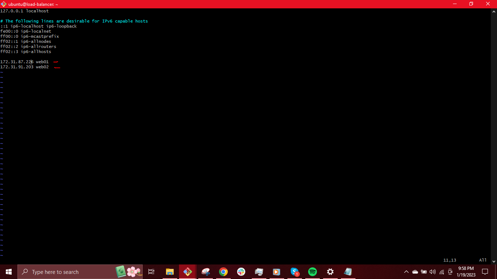

Create an Ubuntu Server 20.04 EC2 instance

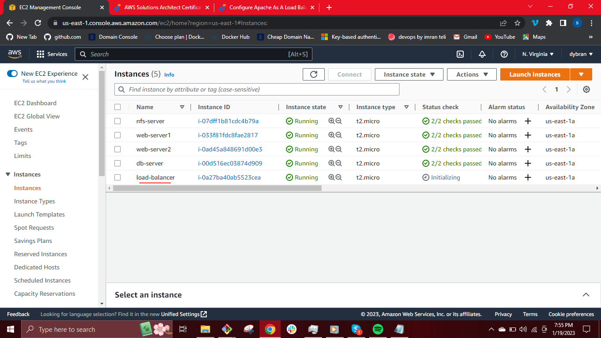

Open __TCP port 80__ on  laod balancer by creating an Inbound Rule in Security Group.

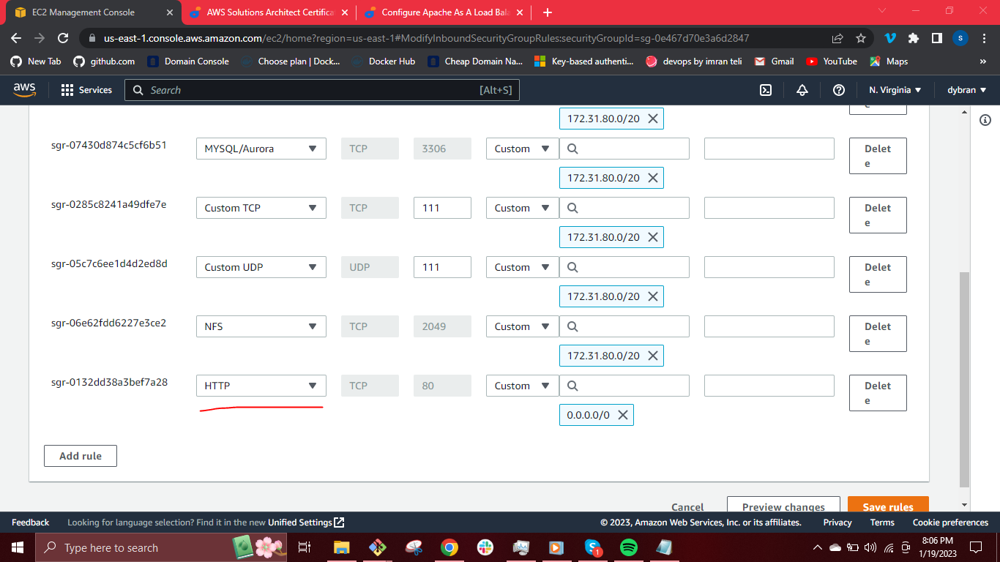

Install Apache Load Balancer on server and configure it to point traffic coming to load balancer to both Web Servers.

```$ sudo apt update -y```


```$ sudo apt install apache2 -y```


```$ sudo apt-get install libxml2-dev```

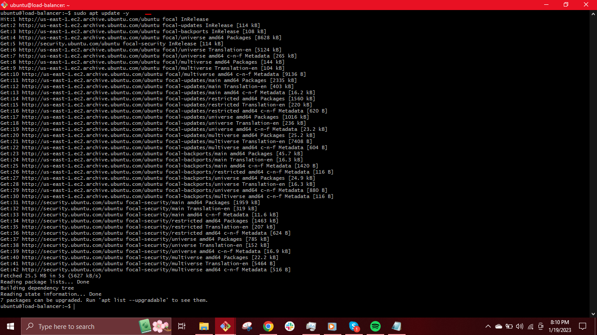
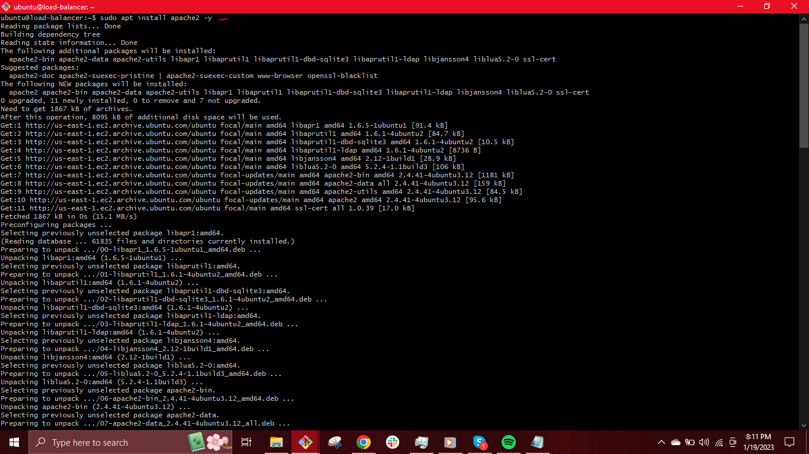
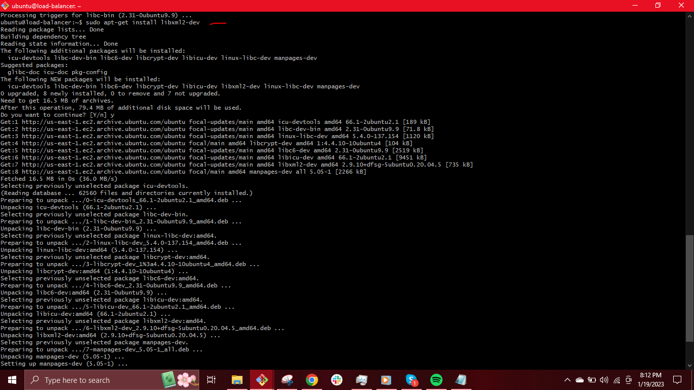

Enable following modules


```$ sudo a2enmod rewrite```

```$ sudo a2enmod proxy```

```$ sudo a2enmod proxy_balancer```

```$ sudo a2enmod proxy_http```

```$ sudo a2enmod headers```

```$ sudo a2enmod lbmethod_bytraffic```

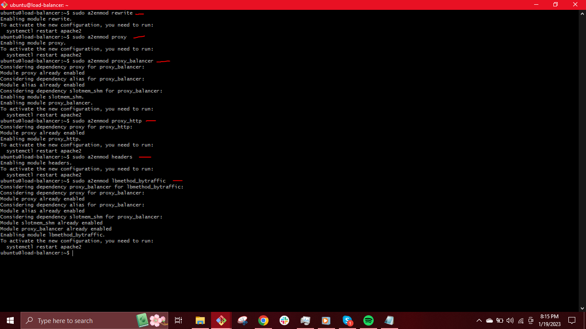

Start apache2 service and make sure it is up and running

```$ sudo systemctl start apache2```

```$ sudo systemctl status apache2```

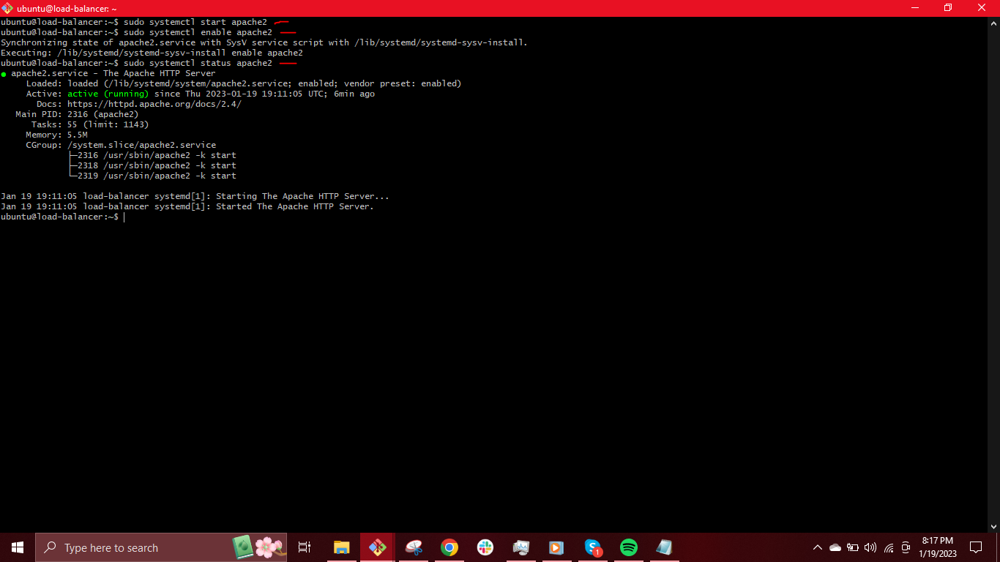

Configure load balancing

Open __"/etc/apache2/sites-available/000-default.conf"__

```$ sudo vi /etc/apache2/sites-available/000-default.conf```

Add below configuration into this section __<VirtualHost *:80>__ and  __<VirtualHost__


```
<Proxy "balancer://mycluster">
               BalancerMember http://<WebServer1-Private-IP-Address>:80 loadfactor=5 timeout=1
               BalancerMember http://<WebServer2-Private-IP-Address>:80 loadfactor=5 timeout=1
               ProxySet lbmethod=bytraffic
               # ProxySet lbmethod=byrequests
        </Proxy>

        ProxyPreserveHost On
        ProxyPass / balancer://mycluster/
        ProxyPassReverse / balancer://mycluster/
```

We will replace the __"private-IP-addresses"__ with the names we gave to the webservers earlier on i.e __web01__ and __web02__.

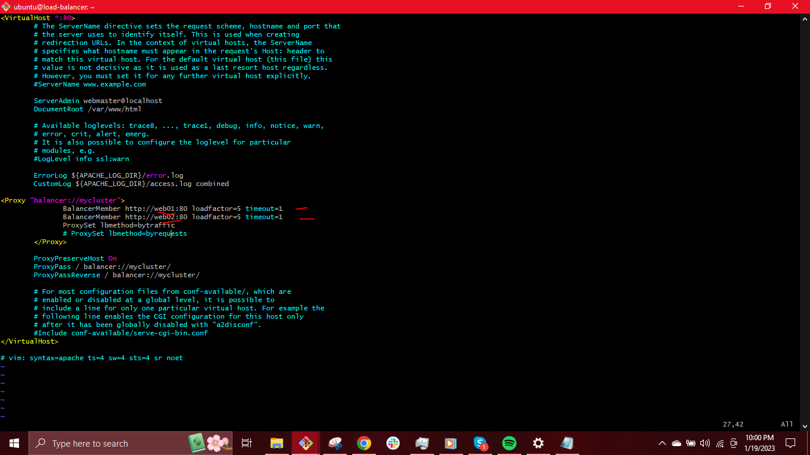

__" ESC + wq = ENTER"__ to save.

Restart Apache service

```$ sudo systemctl restart apache2```

[bytraffic](https://httpd.apache.org/docs/2.4/mod/mod_lbmethod_bytraffic.html) balancing method will distribute incoming load between your Web Servers according to current traffic load. We can control in which proportion the traffic must be distributed by loadfactor parameter.


To verify that our configuration works, we try to access the load balancer's public IP address from the browser.

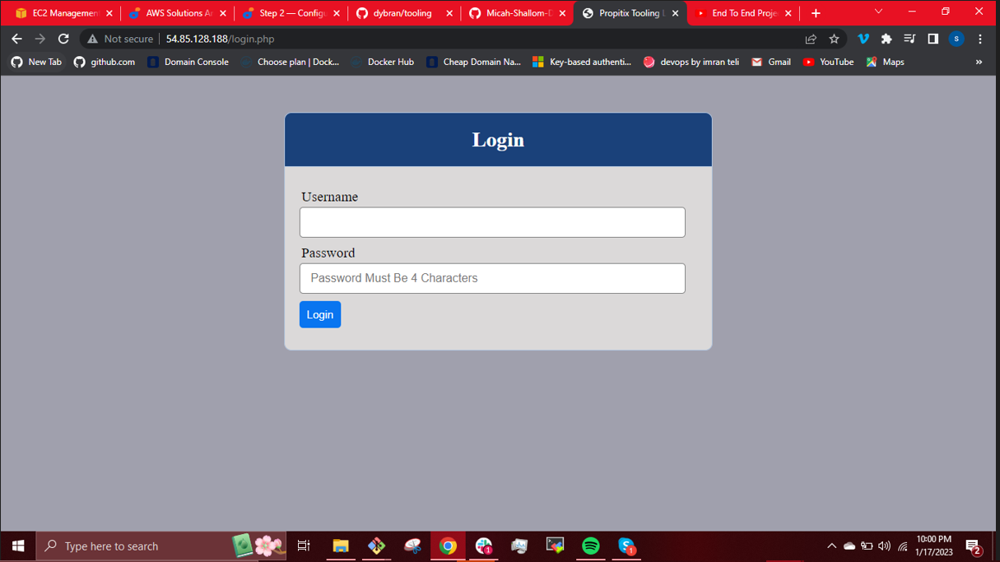

Then log in using the username and password we already set in the database i.e

__"username: admin"__

__"password: admin"__

```http://<Load-Balancer-Public-IP-Address-or-Public-DNS-Name>/index.php```


Open two consoles for both Web Servers and run following command

```$ sudo tail -f /var/log/httpd/access_log```

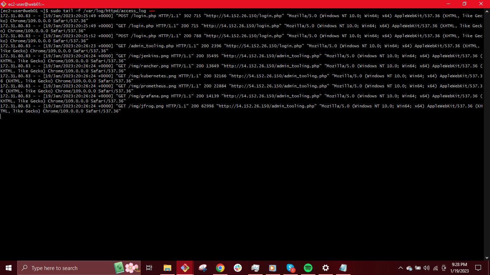

We refresh the browser page several times and make sure that both servers receive __HTTP GET requests__ from the load balancer. New records will appear in each server’s log file. The number of requests to each server will be approximately the same since we set loadfactor in the configuration (i.e __loadfactor=5__ )to the same value for both servers This means that traffic will be distributed evenly between them.

__N/B:__
The __web01__ and __web02__ configurations are internal configurations and it is also local to your Load balancer server, these names will neither be ‘resolvable’ from other servers internally nor from the Internet.

We have just __implemented a Load balancing Web Solution for our DevOps team.__


